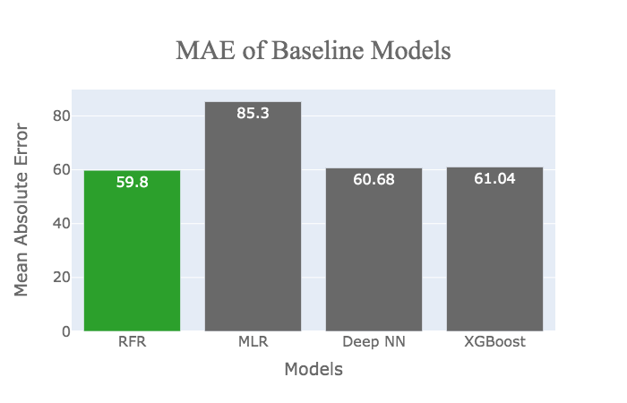
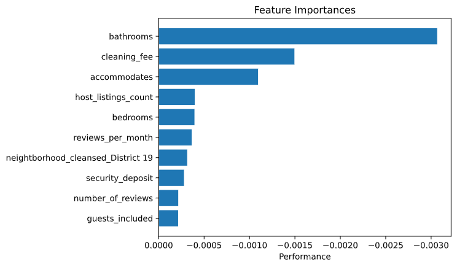
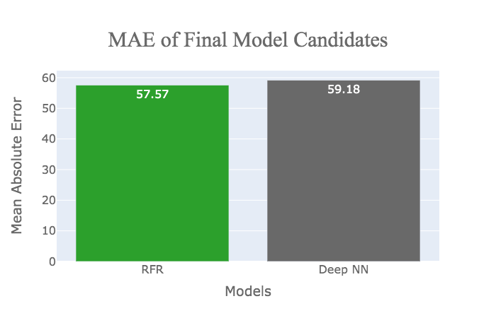

# **Eat.Sleep.Data - Predicting Airbnb Prices in Nashville** 

## Project Overview
The purpose of this project is to analyze historical Airbnb data with machine learning models to predict the expected rental price of a given space based on location, size, amenities, reviews, host performance, and other relevant variables. This prediction model will be incorporated in a tool for property owners to use to determine the suggested rental price for their space. The model will incorporate seasonal trends and weekday versus weekend premiums to adjust the suggested price for the dates the space will be listed. Due to the short timeline for this project, the scope will be limited to the Nashville, TN market. 

Link to Web App: <a href = "https://airbnb-price-prediction-stage.herokuapp.com/">Airbnb Price Predictor</a> 
Link to analysis: <a href = "https://github.com/whitneylosinski/Eat.Sleep.Data/blob/main/Airbnb_Analysis.ipynb">Airbnb_Analysis</a>

**Team members:** Alex Conerly, Alex Felice, Betsy Wellington, Hannah Koivisto, Ken Liew, Whitney Losinski

## Project Proposal
Click the following link to view the full initial project proposal.  Note that the current scope of project has been changed from the initial proposal after data and technical exploration. 
- <a href= "https://github.com/whitneylosinski/Eat.Sleep.Data/wiki/Project-Proposal">Project Proposal</a>

## Reason for Selecting this Topic:
In order to find a project, the team scoured Kaggle datasets and other internet sources of data to find potential projects that were of interest to each member.  These potential projects and the associated datasets were added to a shared spreadsheet.  After collecting a number of potential projects, team members voted on the ones they were most interested in, ranking their top three choices.  The project that received the highest score was the Airbnb proposal.  This was initially proposed by a member who mentioned they had been thinking about hosting an Airbnb in their home and thought it might be interesting to find out how much rent they could get for it.  The abundance of data available in open sources for Airbnb also makes this a more manageable project to develop.  

## Questions We Hope to Answer with the Data:
Looking at the wide variety of data available, the team is interested in exploring how the price charged relates to various features of the dataset.  While we are initially exploring all of the variables available, the big question is what really makes a difference in the price that an Airbnb can command.  Here are some of the biggest features we hope to sort out:

* Neighborhood
*  Room Type
*  Number of bedrooms/beds
*  Kitchen
*  Pet friendly
*  Time of year or day of week
*  etc.

## Description of Data Source and Data Exploration:
Click the following link to see a detailed description of the data sources being using for the project.  Additional information about our data exploration can be found in the project proposal above.
- <a href= "https://github.com/whitneylosinski/Eat.Sleep.Data/wiki/ETL">Data Source and Exploration</a>

## Drafts of Machine Learning Model:
Our preliminary model testing before the feature reduction process included two separate tests.  Our first pass at an MLM used a linearRegressor model with multiple variables, thus becoming multiple regression.  A description and link to viewing this model can be found here:

- <a href= "https://github.com/whitneylosinski/Eat.Sleep.Data/blob/main/Machine_Learning_Notebooks/000_Baseline_Linear_Regression.ipynb">MLR Model</a>

The predicted vs actual partial matrix (screenshot of predicted "y") for the MLR model shown below illustrates the poor fit of the linear regression model.  

This initial linearRegressor model produced an R-squared value 0.57, which is not high enough for predictive reliability.  We also ran test models using Ridge Regression, Lasso Regression and partial Least Squares Regression all of which ended up with similar results as the initial linear regression.  

Because we could not improve on the linear regression without more data cleaning, we also wanted to try a random forest regressor.  Since our data set has a large number of input variables, the RF model should be able to better separate the predictors from the non-predictors.  Some additional motivations for using a random forest regression model were as follows:

*  They can sometimes be less prone to overfitting
*  Can be used to rank the importance of input variables in a natural way.
*  Can handle thousands of input variables without variable deletion.
*  Are robust to outliers and nonlinear data.
*  Run efficiently on large datasets

From the initial random forest regressor, we achieved an R-squared value from a testing set of about 0.96 which was suspiciously high.  Hence, we also calculated the "adjusted" R-squared value which penalizes the original R-squared value for having excess features but even after incorporating the adjustment formula, the numerical difference from the original R-squared value was neglible.  Finally, we ran an additional calculation to determine the mean squared error which resulted in a value of about 2983.10.  In addition, this model's mean absolute error was calculated which suggests that the price prediction is off by about $51.58 on average.

To view this preliminary Random Forest Regressor model, follow the link below:
- <a href = "https://github.com/whitneylosinski/Eat.Sleep.Data/blob/main/Machine_Learning_Notebooks/002_RFR_after_bucketing_test.ipynb">RF Regressor Model before feature selection</a>

Following these two baseline tests, the group collaborated on producing a multi-collinearity matrix which revealed numerous variables in the dataset with significantly high collinearity.  With the aid of this matrix, we reduced some variables with bucketing and reran the models for only slight improvement. Additional study by looking at metrics separately on the test versus training datasets has revealed that there is a significant degree of "overfitting" being done by the RF model.   

The most updated version of our RFM can be viewed via this link:

- <a href = "https://github.com/whitneylosinski/Eat.Sleep.Data/blob/main/Machine_Learning_Notebooks/200_Clean_Feat_Sel_and_Final_RFR.ipynb">RF Regressor Model after feature selection</a>

We have used the default split between test and training datasets (25/75).  Because of the model overfitting, we also looked at the metric on a smaller "pruned" model which shows an improved but similar MSE between train and test but reduces the R2 to 86%.  So we clearly have some over-fitting going on that needs to be explored.   

For a more indepth discussion of the MLMs, follow this link:

- <a href = "https://github.com/whitneylosinski/Eat.Sleep.Data/wiki/Machine-Learning-Model-Development">MLM (wiki link)</a>

##  Analysis phase of project

On-going analysis of model results shows that there may be more issues with the data than originally identified.  Discussion of the results can be found in both the Feature Selection Wiki and discussion of the MLM model.

- <a href = "https://github.com/whitneylosinski/Eat.Sleep.Data/wiki/Feature-Selection">Feature Selection (wiki link)</a>

In addition, some statistical analysis can be found by following this link:

- <a href = "https://github.com/whitneylosinski/Eat.Sleep.Data/wiki/Statistical-Analysis">Variable Analysis (wiki link)</a>

## Connection of draft model to Postgres Database:
The models link to the Heroku postgres database as shown in the following image:

- <a href = "https://github.com/whitneylosinski/Eat.Sleep.Data/wiki/Database">Postgres Database Example</a>

## Dashboard
Our initial schema for our dashboard can be seen through the following link, along with a description of how the user will interact with the web app.

- <a href = "https://github.com/whitneylosinski/Eat.Sleep.Data/wiki/Dashboard">Dashboard</a>

To make the functional dashboard, the team developed a Flask application that is deployed to Heroku.  The visual portion of the dashboard was designed using HTML5 while JavaScript was used to create the interactive map and Python was used for taking in the user inputs, using the model to predict the price and then displaying the resulting suggested price.

- <a href = "https://github.com/whitneylosinski/Eat.Sleep.Data/wiki/Flask-App-via-Heroku">Flask Integration</a>

## Second Round of Machine Learning Model Tests:

Following the initial baseline tests, our group observed that the addition of the calendar date data was causing our models to significantly overfit since the inclusion of this data required excessive duplicate entries.  The CY data provides the price for rental by each month and weekend versus weekday with all other features staying the same for the individual location.  Many rentals do not change the price seasonally or for weekends so this creates 24 of the same rows for one rental.  Thus, we made an executive decision to drop the calendar data altogether and reform the baseline tests.  As such, we implemented four strategic model tests which included Multiple Linear Regression, Random Forest Regression, XG Boost, and Deep Neural Network tests.  By comparing the mean absolute error results obtained by these four baseline tests, it was clear that random forest regressor remained the best performing model for our dataset.  For each model test, the cleaned and "one-hot-encoded" data was pulled from Postgres tables, split using Scikit-learn's train_test_split method, and each subsequent model was compared with similar accuracy-based metrics.  In particular, the mean absolute error metric from each model allowed us to discern how much error, on average, our model obtained in predicting an accurate price.  The representative scores observed from each model is summarized below:

To see the notebooks for each baseline model tests follow these links:
-  <a href = "https://github.com/whitneylosinski/Eat.Sleep.Data/blob/main/Machine_Learning_Notebooks/100_Baseline_MLR_on_clean_data.ipynb">Baseline Multiple Linear Regresion Tests Notebook</a>
- <a href = "https://github.com/whitneylosinski/Eat.Sleep.Data/blob/main/Machine_Learning_Notebooks/101_Baseline_RFR_on_clean_data.ipynb">Baseline Random Forest Regressor Tests Notebook</a>
- <a href = "https://github.com/whitneylosinski/Eat.Sleep.Data/blob/main/Machine_Learning_Notebooks/102_Baseline_XGboost_on_clean_data.ipynb">Baseline XG Boost Tests Notebook</a>
- <a href = "https://github.com/whitneylosinski/Eat.Sleep.Data/blob/main/Machine_Learning_Notebooks/103_Baseline_Deep_NN_on_clean_data.ipynb">Baseline Deep Neural Network Tests Notebook</a>

## Model Benefits and Limitations:
As shown above, the Random Forest Regressor performed the best under these controlled conditions and, consequently, was chosen as our model basis.  Of course, all of these models appear limited in their ability to predict the target with extreme accuracy.  Nevertheless, the airbnb data itself has many inconsistencies and Random Forest Regressor demonstrated its prowess above the competitors.  This may be due to the fact that one benefit of this type of ensemble-based model is that it can fare quite well against over-fitting.

## Feature Reduction:

After the second round of baseline model tests which allowed us to select random forest regression as the basis of our model, we were still left with 265 features for predicting our target value of price.  Hence, we employed a final feature reduction step to rank the relative "importance" of each feature in order to determine the best predictors of our target and, thus, reduce the number of features accordingly.  This, in turn, would allow a user in our web app to be able to select from a more reasonably condensed version of features to predict the price.  Specifically, we chose to employ the Scikit-learn's Permutation Feature Importance method as it is considered less prone to over-valuing low importance features when a model is prone to over-fitting. The permutation method does this by randomizing each feature and measuring the error of the model before and after to measure importance.  In short, since our model had already shown signs of overfitting, the permutation method was deemed a good choice.  The results from the feature selection offered the following top ten columns ranked by importance:

## Random Forest Regressor Model Results:

By re-running the random forest regressor on these top ten features alone, the model was able to obtain a mean absolute value of 57.57.  Deep learning models were also tested once more but the RFR still produced slightly better results.  This indicates that our best model remained the Random Forest Regressor and is currently able to predict our target with some accuracy but is, on average, off by about $57.57.   Nevertheless, this current result provides a working model for our dynamic website.

## Communication Protocols:
Our team is using the following mediums for communication purposes:
 - **Discord** - for messaging and basic communication.  Our discord board includes a "general" tab for informational messages, a "data-discovery" tab for information on datasets, and "important_and_useful_links" for the links to the sourced database, the Postgres database, the web app and any other important links.  We also have the ever important "off-topic" tab for general socializing.
 - **Zoom** - for team meetings and video conferencing.  Our zoom calls consist of both scheduled and impromptu meetings set up through our Discord channel.
 - **Trello** - for organizing and documenting tasks.
 - **Github** - for programming and collaborative work. 
   *   Branches - team members have decided to forgo individual named branches and create topic based branches.  Any member named branches are used for their own discovery and scribbles. 

## Requirements File

The link to our requirements file is

- <a href = "https://github.com/whitneylosinski/Eat.Sleep.Data/blob/main/requirements.txt">Requirements</a>

## Presentation
We are using google slides for our presentation.
https://docs.google.com/presentation/d/1Zc1F9oELCDqSdckrNKxSkt8MXX__JlBjGESOXU5EHIo/edit?usp=sharing
